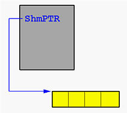
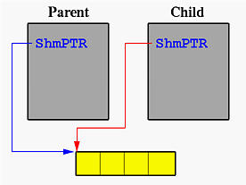

# Shared Memory Processes

The following main function runs as a server. It uses `IPC_PRIVATE` to request a private shared memory. Since the client is the server’s child process created after the shared memory has been created and attached, the child client process will receive the shared memory in its address space and as a result, no shared memory operations are required.

This program asks for a shared memory of four integers and attaches this shared memory segment to its address space. Pointer `ShmPTR` points to the shared memory segment. After this is done, we have the following:

Then, this program forks a child process to run function `ClientProcess()`. Thus, two identical copies of address spaces are created, each of which has a variable `ShmPTR` whose value is a pointer to the shared memory. As a result, the child process has already known the location of the shared memory segment and does not have to use `shmget()` and `shmat()`. This is shown below:

The parent waits for the completion of the child. For the child, it just retrieves the four integers, which were stored there by the parent before forking the child, prints them, and exits. The `wait()` system call in the parent will detect this. Finally, the parent exits.

## Task

You are to write a program that creates two shared variables of type `int`. One integer is the `BankAccount`, another is `Turn`. Both `BankAccount` and `Turn` are initialized to 0. Your program must create two processes, one parent process and one child process, and allow the parent to deposit (i.e., add) money to the `BankAccount`, and also allow the child process to withdraw (i.e., subtract) money from the `BankAccount` using Tanenbaum’s strict alternation (see OS textbook Chap 4). Both the Parent and Child should loop 25 times and follow the rules below each time through the loop.

### Parent (Dear Old Dad) Rules

1. Sleep some random amount of time between 0 - 5 seconds.
2. After waking up, copy the value in `BankAccount` to a local variable `account`.
3. Loop while `Turn != 0` do no-op.
4. If the `account` is <= 100, then try to Deposit Money, else call `printf("Dear old Dad: Thinks Student has enough Cash ($%d)\n", account);`.

#### Deposit Money:

- Randomly generate a balance amount to give the Student between 0 and 100.
- If the random number is even: Deposit the amount into the account, then call `printf("Dear old Dad: Deposits $%d / Balance = $%d\n", balance, account);`.
- If the random number is odd: Then call `printf("Dear old Dad: Doesn't have any money to give\n");`.
- Copy value from local variable `account` back to `BankAccount`.
- Set `Turn = 1`.

### Child (Poor Student) Rules

1. Sleep some random amount of time between 0 - 5 seconds.
2. After waking up, copy the value in `BankAccount` to a local variable `account`.
3. Loop while `Turn != 1` do no-op.
4. Randomly generate a balance amount that the Student needs between 0 and 50, then call `printf("Poor Student needs $%d\n", balance);`.
5. If the balance needed is <= the account: Withdraw the amount from the account, then call `printf("Poor Student: Withdraws $%d / Balance = $%d\n", balance, account);`.
6. If the balance needed is > than the account: Then call `printf("Poor Student: Not Enough Cash ($%d)\n", account);`.
7. Copy value from local variable `account` back to `BankAccount`.
8. Set `Turn = 0`.

Run the reference implementation to compare your output for testing purposes.